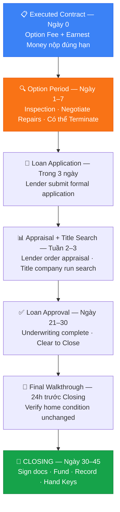

# Transaction Management

## Mục Đích Phòng Ban Này

Phòng 04 là **hệ thống kiểm soát giao dịch** — đảm bảo mỗi deal từ lúc có contract đến closing đều được track đầy đủ, không bỏ sót deadline quan trọng.

## Cách Claude Hỗ Trợ Trong Phòng Này

Claude dùng các file dưới đây để:

- Nhắc Phong về deadline sắp đến khi Phong mô tả trạng thái deal
- Hướng dẫn từng bước trong inspection, appraisal, và title process
- Cung cấp script đàm phán repairs/concessions
- Checklist closing day để không bỏ sót bước nào

<Callout kind="warning">
**Thông tin giao dịch thực tế (tên buyer/seller, địa chỉ, giá)** phải do Phong cung cấp trong từng cuộc trò chuyện. Claude không lưu thông tin client giữa các session.
</Callout>

---

## Điều Hướng Phòng 04

<CardGroup cols={2}>
  <Card title="Active Deals Tracker" icon="layout" href="/04-transaction-management/active-deals-tracker">
    Template theo dõi tất cả deals đang mở — stage, deadline, contact info. Review đầu mỗi tuần.
  </Card>
  <Card title="Contract Checklist" icon="check-square" href="/04-transaction-management/contract-checklist">
    Timeline và checklist đầy đủ từ executed contract đến closing. Dùng ngay khi có contract.
  </Card>
  <Card title="Inspection SOP" icon="search" href="/04-transaction-management/inspection-sop">
    Quy trình 6 bước: schedule inspector → attend → review report → negotiate repairs.
  </Card>
  <Card title="Appraisal SOP" icon="dollar-sign" href="/04-transaction-management/appraisal-sop">
    Quy trình appraisal và cách xử lý low appraisal — options cho buyer và seller.
  </Card>
  <Card title="Title & Escrow" icon="shield" href="/04-transaction-management/title-escrow-notes">
    Title process, red flags cần chú ý, và escrow procedures từ option period đến closing.
  </Card>
  <Card title="Repair Negotiation Scripts" icon="message-circle" href="/04-transaction-management/repair-negotiation-scripts">
    Scripts đàm phán repairs sau inspection. Templates cho request, counter, và acceptance.
  </Card>
  <Card title="Closing Day Checklist" icon="key" href="/04-transaction-management/closing-day-checklist">
    Checklist ngày closing cho buyer và seller. Dùng 48-72 giờ trước signing appointment.
  </Card>
</CardGroup>

---

## Texas Transaction Timeline — Tổng Quan

*(Từ Executed Contract đến Closing — typical residential deal)*

---

## Contacts Cần Có Trong Mỗi Transaction

*(Phong điền cho từng deal cụ thể trong conversation)*

- **Lender/Loan Officer:** _______________
- **Title Company:** _______________
- **Inspector:** _______________
- **Buyer's Agent (nếu là listing side):** _______________
- **Seller's Agent (nếu là buyer side):** _______________
- **HOA Management (nếu có):** _______________
